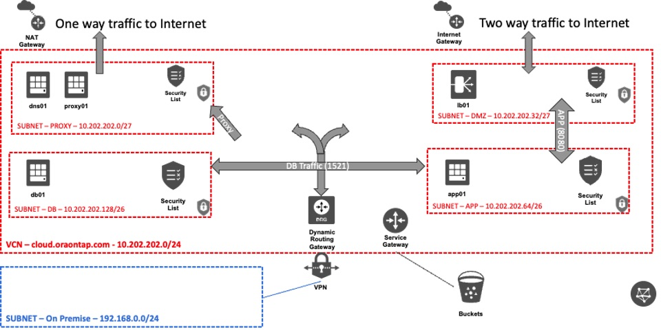

# OCI Network Setup FAST

How to setup your OCI network FAST, this project contains Terraform code and additional scripts to build out a fully functional and secure network for Oracle Cloud Infrastrucutre.

## Folder structure

Each high level build component has it's own folder to make it easier to deploy / update / manage the Terraform code.

- compartments - this builds out the compartments
- network - this builds out all network components (VCN, subnets, security lists, route tables, etc.)
- servers - this builds out all the servers
- test - this is a simple Terraform script to test your OCI connection
- scripts - these are automation scripts used to build out servers during the demonstration

The layout is based on how (in-general) changes would be implimented to the infrastructure.

There are two shared files that are duplicated to each directory

- secret.auto.tfvars - you must make this file and populate it with your secure OCI connection information
- variables.tf - definition of variables used in the Terraform scripts

## Design

The basic design is to provide a segmented / compartmentalized network in OCI that could support a simple application.  The network could easily be grown to support more if needed.  Main configuraiton settings are handled by variables.

Seperation of server function and access to the internet is designed into the subnets.  All non-application traffic would be goverend to the internet through DNS and PROXY servers that are built out as part of the design.  As much basic configuration as can be automated is already in the scripts.

*Note: version 1.0 has a little extra hard coding that will be weeded out in future verions*

### compartments

The basic design has two compartments for seperation of cloud console administrators.

- Network - this will hold all the network settings, security, VNC, subnets, and load balancers
- Servers - this will hold all the servers

This could easily be expanded if you want additioanl compartments for production vs non-production or to split things out by application such as ERP vs a web application.

### network

The basic design is four networks that have spcific access to the internet and each other.

### servers

